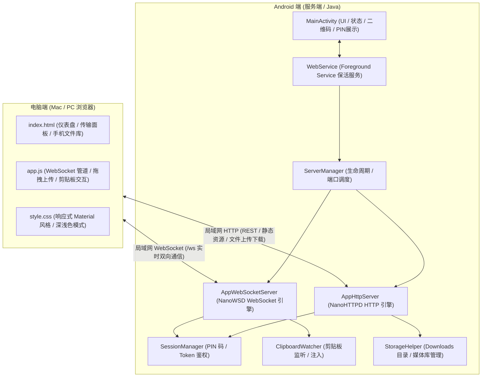

# ContextShared 系统设计文档 (System Design Specification)

- **创建日期**：2026-08-23
- **状态**：已批准 (Approved)
- **技术栈**：Java + Android View/XML + NanoHTTPD / NanoWSD + Vanilla HTML5/CSS3/JS Web 控制台

---

## 1. 系统概述与目标

**ContextShared** 是一个将 Android 手机作为局域网本地服务器的应用。通过在手机端启动轻量级 HTTP 与 WebSocket 服务，Mac、Windows、Linux 或任何带有现代浏览器的设备均无需安装额外客户端，只需在同一 Wi-Fi 或手机热点下访问手机 IP，即可实现：
1. **双向即时剪贴板同步与文本流传输**。
2. **大文件、多文件拖拽高速双向传输（上传与下载）**。
3. **快速操作指令（在手机打开网址、快捷安装 APK）**。
4. **PIN 码 / 授权弹窗配对安全机制**。

---

## 2. 总体系统架构



---

## 3. Android 端核心模块划分

### 3.1 `MainActivity`
- **界面元素**：
  - 服务开启/停止切换开关（Switch）。
  - 当前网络状态与 IP 地址展示（如 `http://192.168.1.100:8080`）。
  - 动态生成的二维码（基于 ZXing 生成，方便扫码直达）。
  - 4 位随机连接配对 PIN 码及刷新按钮。
  - 活跃连接设备列表与实时日志卡片。
- **职责**：
  - 处理运行时权限请求（`POST_NOTIFICATIONS`, `READ_MEDIA_*`, `MANAGE_EXTERNAL_STORAGE` 等）。
  - 绑定或启动 `WebService` 前台服务。

### 3.2 `WebService` (Foreground Service)
- 运行为 Android 前台服务，配置 `FOREGROUND_SERVICE_DATA_SYNC` / `SPECIAL_USE` 类型。
- 维护常驻通知栏（显示连接 IP 地址、活跃客户端数量、快捷停止按钮）。
- 监听网络变化（`ConnectivityManager.NetworkCallback`），动态感知 Wi-Fi 断开/重连或热点开启并刷新 IP。
- 确保应用切入后台或锁屏时，Socket 监听不被系统挂起。

### 3.3 `ServerManager`、`AppHttpServer` 与 `AppWebSocketServer`
- 基于 `org.nanohttpd:nanohttpd` 与 `org.nanohttpd:nanohttpd-websocket`。
- **端口管理**：默认监听 `8080`，若被占用自动探测递增 `8081` ~ `8089`。
- **静态资源分发**：从 Android `assets/web/` 读取并分发 HTML/JS/CSS，自动映射 MIME 类型，支持 Gzip 压缩。
- **文件分发与断点续传**：支持 HTTP 206 Partial Content 与 `Range` 请求头，支持视频在电脑浏览器中流式在线播放。
- **流式文件上传**：使用 Multipart 解析器将电脑端上传的大文件直接写入外部存储，避免全量读入内存。

### 3.4 `SessionManager`
- 维护服务端临时生成的 PIN 码与已授权客户端的 Session Token。
- 支持白名单机制（验证通过的客户端在有效会话期内免重复输入 PIN 码）。

### 3.5 `ClipboardWatcher`
- 注册 `ClipboardManager.OnPrimaryClipChangedListener` 监听手机端剪贴板变动，去重后广播至 WebSocket 客户端。
- 提供线程安全写入方法；结合前台服务通知，当电脑推送文本到手机时展示 Heads-up Notification 确保即时触达。

---

## 4. 通信协议与 API 规范

### 4.1 HTTP REST 接口

| 接口路径 | 方法 | 鉴权 | 说明 |
| :--- | :--- | :--- | :--- |
| `/*` | `GET` | 否 | 加载内置在 `assets/web/` 的静态前端资源 |
| `/api/info` | `GET` | 否 | 获取手机设备名称、电量、存储空间、认证模式等基础信息 |
| `/api/auth/verify` | `POST` | 否 | 提交 `{ "pin": "8848" }`，验证通过返回 `{ "token": "..." }` |
| `/api/files/list` | `GET` | 是 | 获取手机共享目录下的文件列表（支持按类别过滤） |
| `/api/files/upload` | `POST` | 是 | 接收多文件 Multipart 上传，直接流式落盘到 `Downloads/ContextShared/` |
| `/api/files/download` | `GET` | 是 | 下载指定文件（支持 `Range` 请求头流式点播/续传） |
| `/api/action/open-url` | `POST` | 是 | 提交 `{ "url": "..." }` 并在手机默认浏览器中打开 |
| `/api/action/install-apk`| `POST`| 是 | 触发手机系统包安装器安装指定的 APK |

### 4.2 WebSocket 实时消息（`/ws?token=...`）

消息格式统一为 JSON 结构：
```json
{
  "type": "CLIPBOARD_PUSH | CLIPBOARD_SEND | DEVICE_STATUS | PING | PONG",
  "payload": { ... },
  "timestamp": 1724400000000
}
```

- `CLIPBOARD_PUSH`（手机 -> 电脑）：推送手机端复制的文本。
- `CLIPBOARD_SEND`（电脑 -> 手机）：电脑端提交需要写入手机的文本。
- `DEVICE_STATUS`（手机 -> 电脑）：广播电量与存储等状态。
- `PING` / `PONG`：双向心跳检测（15 秒间隔）。

---

## 5. Web 端架构与交互体验

1. **单页架构 (SPA)**：完全使用原生 HTML5、CSS3、Vanilla JS 实现，零 npm 依赖，打包在 APK 内部。
2. **响应式与无网络依赖**：
   - 包含自适应深色/浅色模式（遵循系统配色）。
   - 图标与样式全部内联或本地打包，在无公网的局域网/热点下 100% 离线可用。
3. **全局拖拽上传**：
   - 拖拽任意文件至浏览器窗口即唤起上传遮罩，支持多文件并发队列、实时速度与进度条。
4. **剪贴板一键同步**：
   - 手机复制内容实时展现在卡片顶部，一键写入电脑剪贴板；输入框支持 `Enter` / `Cmd+Enter` 快速发送到手机。

---

## 6. 存储、权限与异常处理

1. **存储适配**：
   - 上传目标目录：`Environment.DIRECTORY_DOWNLOADS + "/ContextShared"`。
   - 文件写入完成后自动调用 `MediaScannerConnection.scanFile` 刷新系统媒体库。
2. **权限处理**：
   - `android.permission.INTERNET`
   - `android.permission.ACCESS_NETWORK_STATE`
   - `android.permission.ACCESS_WIFI_STATE`
   - `android.permission.FOREGROUND_SERVICE`
   - `android.permission.FOREGROUND_SERVICE_DATA_SYNC`
   - `android.permission.POST_NOTIFICATIONS`
   - `android.permission.READ_EXTERNAL_STORAGE` / `READ_MEDIA_*`
3. **容错机制**：
   - 端口冲突自增轮询。
   - 电脑 Web 端指数退避自动重连。
   - 大文件传输边收边写，固定流缓冲区，杜绝内存溢出。
